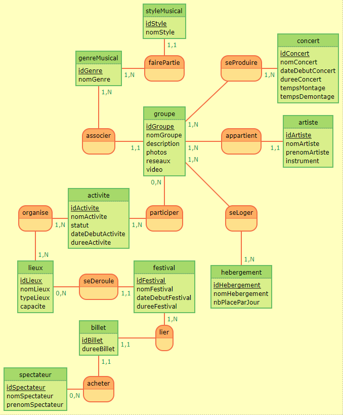

# Rendu1 SAE BD WEB Festiut'O
---
### Pigoreau Nathan 23A, Gardelle Anthony 23A
---
## MCD

---
## Les dépendances fonctionnels
- <ins>id_Activite</ins> -> nom_Activite, statut, date_Debut_Activite, duree_Activite
- <ins>id_Artiste</ins> -> nom_Artiste, prenom_Artiste, instrument, _#id_Groupe_
- <ins>id_Billet</ins> -> duree_Billet, _#id_Festival_, _#id_Spectateur_
- <ins>id_Concert</ins> -> nom_Concert, date_Debut_Concert, duree_Concert, temps_Montage, temps_Demontage
- <ins>id_Festival</ins> -> nom_Festival, date_Debut_Festival, duree_Festival, _#id_Lieux_
- <ins>id_Genre</ins> -> nom_Genre
- <ins>id_Groupe</ins> -> nom_Groupe, description, photos, reseaux, video, _#id_Genre_
- <ins>id_Hebergement</ins> -> nom_Hebergement, nb_Place_Par_Jour
- <ins>id_Lieux</ins> -> nom_Lieux, type_Lieux, capacite
---
## Les contraintes
- Les clés étrangères dans les tables, telles que _#id_Groupe_, _#id_Festival_, et _#id_Spectateur_, doivent faire référence à des enregistrements existants dans les tables parentes. Cela garantit l'intégrité des données.  
-- NOT NULL
- Les dates de début et de fin des activités, des concerts et du festival doivent respecter une séquence logique (la date de début doit être antérieure à la date de fin).  
-- CHECK
- Les temps de montage et de démontage des concerts doivent être compatibles avec la durée du concert et les heures de début et de fin du festival.  
-- CHECK
- La capacité des lieux (table LIEUX) doit être prise en compte pour s'assurer que le nombre de spectateurs ne dépasse pas la capacité du lieu lors de la programmation des concerts.  
-- TRIGGER
- La durée du billet (table BILLET) doit être cohérente avec la durée du festival, c'est-à-dire qu'un billet d'une journée ne doit pas permettre l'accès à des concerts au-delà de cette journée.  
-- TRIGGER
- Par exemple, un artiste (table ARTISTE) doit être associé à un groupe (table GROUPE) via une relation (#id_Groupe), et un groupe doit être associé à un genre musical (table GENRE) via une relation (#id_Genre).  
-- Clé étrangers
- Les noms des festivals, des lieux, des groupes, des artistes, etc., doivent être uniques pour éviter les doublons.  
-- UNIQUE
- Les activités (table ACTIVITE) doivent respecter la capacité des lieux où elles se déroulent.  
-- TRIGGER
- Les billets (table BILLET) doivent être liés au festival auquel ils donnent accès.  
-- TRIGGER
---